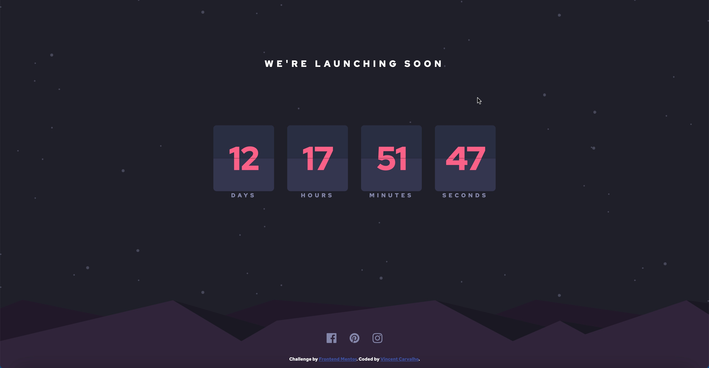

# Frontend Mentor - Launch countdown timer solution

This is a solution to the [Launch countdown timer challenge on Frontend Mentor](https://www.frontendmentor.io/challenges/launch-countdown-timer-N0XkGfyz-). Frontend Mentor challenges help you improve your coding skills by building realistic projects. 

## Table of contents

- [Overview](#overview)
  - [The challenge](#the-challenge)
  - [Screenshot](#screenshot)
  - [Links](#links)
- [My process](#my-process)
  - [Built with](#built-with)
  - [What I learned](#what-i-learned)
  - [Useful resources](#useful-resources)
- [Author](#author)
- [Acknowledgments](#acknowledgments)

## Overview

### The challenge

Users should be able to:

- See hover states for all interactive elements on the page
- See a live countdown timer that ticks down every second (start the count at 14 days)
- **Bonus**: When a number changes, make the card flip from the middle

### Screenshot

### Links

- Solution URL: [https://github.com/CarvalhoVincent/launch-countdown-timer]
- Live Site URL: [https://carvalhovincent.github.io/launch-countdown-timer/]

## My process

### Built with

- Semantic HTML5 markup
- CSS custom properties
- Flexbox
- Mobile-first workflow

### What I learned
 I learned how to make a countdown with date and how to convert in days hours minutes etc...
 Also learned some skills for CSS animations.

### Useful resources

- [https://www.w3schools.com] - Used it for some reminders about CSS and JS.
- [https://stackoverflow.com/] - Used it for some reminders, and problems that I have.
- [https://github.com/WebDevSimplified/countdown-flip-timer] - It helps me for the flip card function.

## Author

- Frontend Mentor - [@CarvalhoVincent](https://www.frontendmentor.io/profile/CarvalhoVincent)

## Acknowledgments

WebDevSimplified helps me for the flip function.

# launch-countdown-timer
